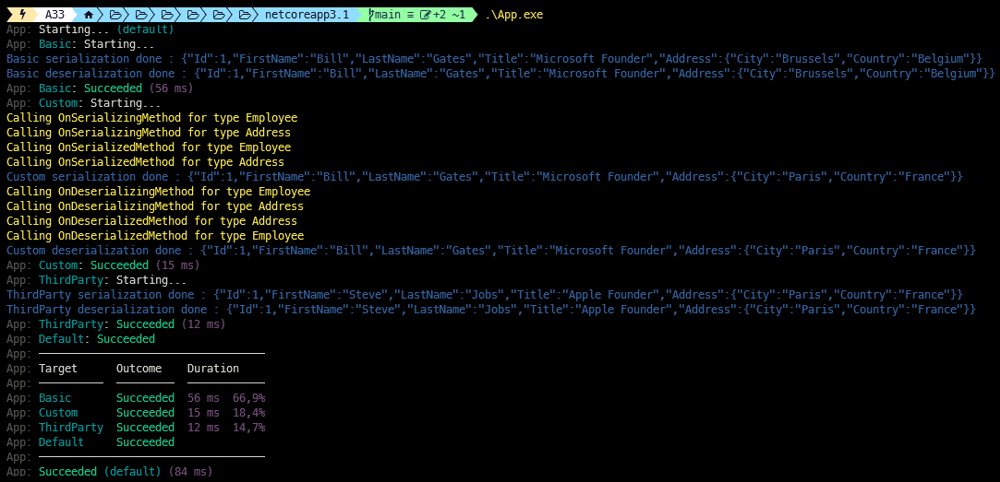

[](https://github.com/aimenux/BinaryFormatterDemo/actions/workflows/ci.yml)

# BinaryFormatterDemo
```
Implementing serialization/deserialization with binary formatter
```

> In this repo, i m implementing 3 ways of serialization/deserialization with [binary formatter](https://docs.microsoft.com/en-us/dotnet/api/system.runtime.serialization.formatters.binary.binaryformatter) :
>
> :one: **BasicSerialization** : models are only decorated with [Serializable attribute](https://docs.microsoft.com/en-us/dotnet/api/system.serializableattribute)
>
> :two: **CustomSerialization** : models are decorated with [Serializable attribute](https://docs.microsoft.com/en-us/dotnet/api/system.serializableattribute) and implement [ISerializable interface](https://docs.microsoft.com/en-us/dotnet/api/system.runtime.serialization.iserializable)
>
> :three: **ThirdPartySerialization** : models are considered as third party classes (can't be modified), serialization is supported through [ISerializationSurrogate interface](https://docs.microsoft.com/en-us/dotnet/api/system.runtime.serialization.iserializationsurrogate)
>
>
> To run code in debug or release mode, type the following commands in your favorite terminal : 
> - `.\App.exe`
> - `.\App.exe default`
> - `.\App.exe Basic`
> - `.\App.exe Custom`
> - `.\App.exe ThirdParty`
>
>
> 
>

**`Tools`** : vs19, net 3.1, binary formatter, bullseye
